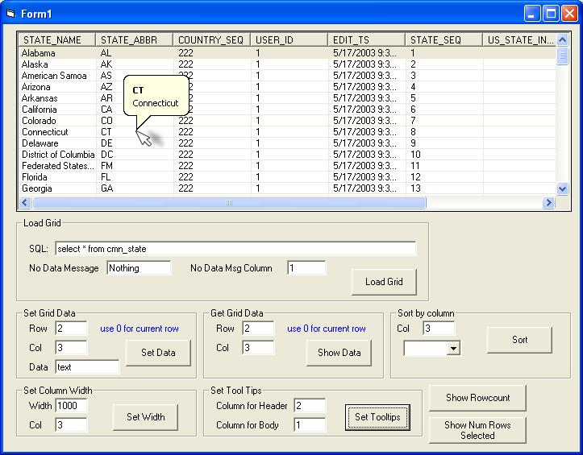



## Grid control based on ListView control

### Description

This is a grid control that is based on VB's ListView control. It includes methods to get and set individual cell data, row counts, column sorting, and column widths. I got the code that is used for the multi-line tooltips from somebody else's PSC submission.
 
### More Info
 
The "LoadGrid" method accepts an SQL string and a connection string for the database.

             |
---                |---
**Submitted On**   |2003-09-15 08:23:32
**By**             |[VB Bob](https://github.com/Planet-Source-Code/PSCIndex/blob/master/ByAuthor/vb-bob.md)
**Level**          |Advanced
**User Rating**    |5.0 (20 globes from 4 users)
**Compatibility**  |VB 6\.0
**Category**       |[Custom Controls/ Forms/  Menus](https://github.com/Planet-Source-Code/PSCIndex/blob/master/ByCategory/custom-controls-forms-menus__1-4.md)
**World**          |[Visual Basic](https://github.com/Planet-Source-Code/PSCIndex/blob/master/ByWorld/visual-basic.md)
**Archive File**   |[Grid\_contr1645589152003\.zip](https://github.com/Planet-Source-Code/vb-bob-grid-control-based-on-listview-control__1-48509/archive/master.zip)

